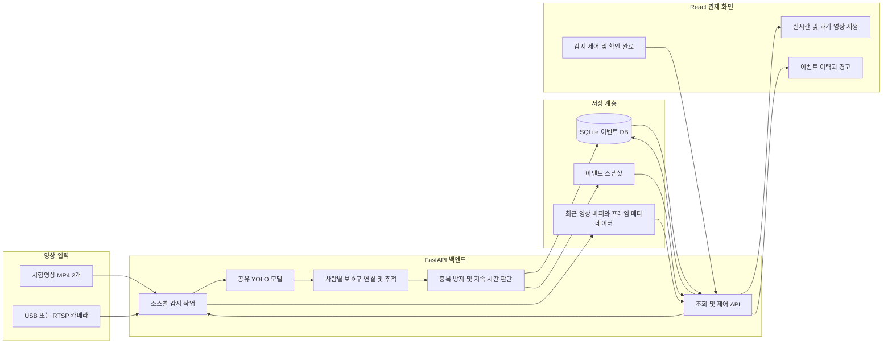
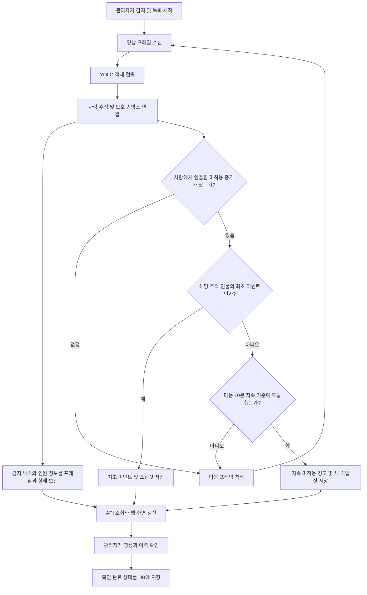

# 현장지킴 — AI 기반 건설현장 안전 모니터링

**Capstone Design Project · AI Construction Safety Monitoring**

건설현장 영상을 분석해 작업자의 보호구 미착용 의심 상황을 감지하고, 관리자가 영상과 이벤트 이력을 함께 확인할 수 있도록 구현한 웹 관제 시스템입니다. YOLO의 객체 검출 결과를 사람별 보호구 연결·추적 로직과 결합하고, 감지 결과를 DB 저장부터 웹 화면 표시까지 연결하는 것을 목표로 합니다.

## 1. 프로젝트 배경과 목표

CCTV 영상을 사람이 지속적으로 확인하는 방식은 여러 장면을 동시에 살펴야 하고, 특정 상황이 언제 발생했는지 다시 찾아야 하는 부담이 있습니다. 이 프로젝트는 보호구 미착용 의심 장면을 자동으로 기록해 관리자의 확인을 돕고, 같은 사람에 대한 반복 기록을 줄이면서 장시간 지속되는 상황을 다시 알리는 관제 흐름을 제안합니다.

| 목표 | 구현 방향 |
|---|---|
| 영상 기반 안전 모니터링 | 사람·안전모·안전조끼 관련 객체를 YOLO로 검출 |
| 확인 가능한 감지 이력 | 감지 시각, 카메라, 신뢰도, 인원, 실제 스냅샷을 저장 |
| 불필요한 반복 알림 감소 | 같은 추적 인물의 최초 미착용을 기록하고 지속 시간에 따라 재알림 |
| 상황 확인과 사후 조회 | 실시간 화면, 최근 영상 탐색, 이벤트 필터, 확인 완료 처리 제공 |
| 실제 데이터 기반 서비스 | YOLO → 백엔드 → SQLite → API → React 화면을 연동 |

현재 시스템은 **미착용 의심 상황을 알려 관리자의 판단을 보조하는 시제품**입니다. 모델 검출 결과만으로 안전 위반을 확정하거나 사고 예방 효과를 입증한 시스템은 아닙니다.

## 2. 시스템 아키텍처



- **입력 계층:** CAM-01은 `test.mp4`, CAM-02는 `test2.mp4`를 사용합니다. CAM-01은 환경변수로 실제 카메라 입력으로 전환할 수 있습니다.
- **분석 계층:** 소스마다 독립 감지 작업을 실행하고, 공유 YOLO 모델의 추론 호출은 잠금으로 직렬화합니다. 사람별 추적·이벤트 상태와 녹화 버퍼는 소스별로 분리합니다.
- **저장 계층:** 이벤트 정보와 확인 상태는 SQLite에, 영상 프레임·메타데이터·스냅샷은 파일로 저장합니다.
- **서비스 계층:** FastAPI가 감지 제어와 저장 데이터 조회를 담당하고, React가 API를 주기적으로 조회해 화면을 갱신합니다.

### 기술 구성

| 구분 | 사용 기술 | 역할 |
|---|---|---|
| 프론트엔드 | React, Vite, CSS, Lucide React | 관제 대시보드, 이벤트 조회, 재생 제어 |
| 백엔드 | Python, FastAPI, Uvicorn | API, 감지 작업 제어, 데이터 전달 |
| 영상 분석 | Ultralytics YOLO, PyTorch, OpenCV | 영상 입력, 객체 검출, 감지 박스 시각화 |
| 사람별 처리 | 자체 공간 연결·추적 로직 | 보호구와 사람 연결, 추적 ID 기반 중복 방지 |
| 데이터 저장 | SQLite, JPEG, JSON | 이벤트 DB, 스냅샷, 탐색 가능한 최근 영상 |
| 개발·검증 | Git/GitHub, unittest, FastAPI TestClient | 형상 관리, 기능·통합 검증 |

## 3. 프로그램 처리 흐름



1. 관리자가 영상을 선택하고 감지를 시작하면 백엔드 작업이 프레임을 읽습니다.
2. YOLO가 클래스, 박스 좌표, 신뢰도를 반환합니다.
3. 미착용 박스를 사람 박스와 공간적으로 연결하고, 사람 추적 ID를 갱신합니다.
4. 최초 감지 또는 지속 시간 기준에 해당하면 이벤트를 DB에 저장하고 실제 프레임 스냅샷을 연결합니다.
5. 영상은 감지 박스와 당시 인원 정보를 함께 보관하므로 과거 재생에서도 같은 시점의 결과를 표시합니다.
6. 프론트가 조회 API로 이벤트와 상태를 갱신하며, 관리자의 확인 완료 처리는 DB에 반영합니다.

**시청 제어와 감지 제어는 분리돼 있습니다.** 화면 일시정지·과거 탐색은 서버 감지와 저장을 멈추지 않습니다. 서버 처리는 별도의 감지·녹화 중단 버튼으로 제어합니다.

## 4. 핵심 설계

### 4.1 객체 검출과 미착용 판단의 구분

현재 실행 모델 클래스는 `Person`, `Hardhat`, `NO-Hardhat`, `Safety Vest`, `NO-Safety Vest`입니다.

모델이 보호구를 검출하지 못했다는 이유만으로 미착용으로 판정하지 않습니다. 명시적인 `NO-Hardhat` 또는 `NO-Safety Vest` 박스가 사람의 머리·몸통 영역에 연결되는 경우를 미착용 의심 증거로 사용합니다. 연결이 불분명한 박스는 사람별 미착용 인원과 이벤트에서 제외하고 별도 미연결 건수로 표시합니다.

- 감지 인원은 해당 프레임의 `Person` 검출 수입니다.
- 미착용 인원은 하나 이상의 미착용 증거가 연결된 사람 수입니다.
- 한 사람의 여러 보호구 미착용을 전체 미착용 인원에서는 한 명으로 계산합니다.
- 신뢰도는 모델의 해당 검출 점수이며, 실제 안전 위반의 확률을 의미하지 않습니다.

### 4.2 사람별 중복 방지와 10분 재경고

박스의 위치·겹침·이동 정보를 이용해 카메라별 추적 ID를 유지합니다. 최초 이벤트는 같은 추적 인물당 한 건만 기록하고, 여러 보호구가 동시에 미착용이면 최초 프레임의 유형을 한 이벤트에 묶습니다.

| 조건 | 처리 |
|---|---|
| 해당 추적 인물의 최초 미착용 | 최초 이벤트와 실제 스냅샷 저장 |
| 같은 인물의 반복 감지 | 매 프레임 추가 저장하지 않음 |
| 미착용 상태 10분 지속 | 새로운 경고 이벤트와 스냅샷 저장 |
| 계속 지속되어 20분·30분 도달 | 10분 구간마다 한 건씩 재경고 |
| 미착용 증거가 2초 넘게 끊김 | 지속 시간 계산 초기화 |
| 추적 ID 변경 또는 감지 재시작 | 새 추적 상태로 처리 |

10분은 이 프로젝트의 **재알림 기준**이며 법적 안전 기준이 아닙니다. 2초까지의 짧은 검출 누락은 허용하지만, 누락 자체를 보호구 착용 완료로 확정하지 않습니다. 시험영상에서는 영상 내 시간을, 실제 카메라에서는 감지 경과 시간을 사용합니다. DB의 고유 이벤트 키는 동일 시험영상 재생 시 같은 키의 중복 삽입을 방지합니다.

### 4.3 최근 영상 재생과 시점 일치

단순 이미지 스트림에 재생 바만 추가하는 대신, JPEG 프레임과 JSON 메타데이터를 묶어 최근 구간을 탐색할 수 있도록 구현했습니다.

- 기본 보관 시간은 5분이며 설정에서 변경할 수 있습니다.
- 각 프레임에 감지 박스가 그려진 이미지, 감지 목록, 당시 인원, 영상 위치와 수신 시각을 함께 기록합니다.
- 시간·용량 제한에 따라 오래된 파일을 정리합니다.
- 보관 범위 밖의 시점은 재생할 수 없으며, 이벤트 DB와 영상 보관 기간은 서로 다릅니다.

### 4.4 이벤트 데이터 구조

기존 `safety_events` 테이블을 재사용하고 필요한 열만 추가합니다. 기존 기록을 삭제하지 않습니다.

| 정보 | 주요 필드 | 용도 |
|---|---|---|
| 이벤트 식별 | `id`, `event_key` | 이력 식별과 중복 삽입 방지 |
| 감지 증거 | `event_type`, `violation_types`, `confidence`, `model_name` | 모델 결과와 미착용 유형 기록 |
| 발생 위치·시각 | `camera_name`, `source_name`, `detected_at`, `video_seconds` | 카메라와 감지·영상 시점 확인 |
| 인원·추적 | `person_track_id`, `person_count`, `noncompliant_person_count`, `event_person_count` | 기록 대상과 당시 전체 인원 구분 |
| 지속 경고 | `event_reason`, `sustained_seconds`, `repeat_index` | 최초 감지와 장기 미착용 경고 구분 |
| 영상 근거 | `snapshot_path`, `recording_id`, `frame_id` | 스냅샷 및 보관 영상 연결 |
| 확인 상태 | `review_status`, `created_at` | 관리자 확인과 DB 저장 시각 기록 |

영상 보관 설정은 별도의 `monitor_settings` 테이블에 저장합니다. 확인 완료는 새로고침 이후에도 유지되며, 영상이 만료된 이벤트에는 재생 불가 안내를 표시합니다.

## 5. 주요 화면과 사용자 흐름

| 화면 | 주요 기능 |
|---|---|
| 현장 모니터링 | 영상 선택, 감지 인원·미착용 추정 인원·오늘 이벤트 카드, 실시간 영상, 감지 시작·중단 |
| 영상 재생 | 시청 일시정지, 전체화면, 확대 보기, 타임라인, 10초 이동, 실시간 복귀 |
| 이벤트 이력 | 최신순 목록, 감지 시각·영상 위치·인원·스냅샷, 날짜·유형·확인 상태 필터 |
| 이벤트 상세 | 실제 감지 근거 확인, 보관 영상으로 이동, 확인 완료 처리 |
| 경고·설정 | 장기 미착용 경고와 미확인 안내, 최근 영상 보관 시간 설정 |

관리자는 **영상 선택 → 감지 시작 → 경고·이력 확인 → 해당 시점 검토 → 확인 완료** 순서로 사용합니다. 로딩, 감지 인원 0명, 이벤트 없음, 서버 실패와 카메라 끊김은 서로 구분해서 표시합니다.

## 6. 검증과 현재 한계

복구한 코드 기준으로 프론트 빌드와 백엔드 테스트 27개를 확인했습니다. 실제 모델·시험영상으로 프레임 진행, DB 이벤트 저장, 스냅샷과 녹화 프레임 연결을 검증했으며, 10분·20분 경고 경계와 누락 후 초기화는 감지 시간을 모의해 검증했습니다.

현재 검증은 기능 동작과 데이터 연결 중심입니다. **현장 환경에서의 정확도·재현율·mAP·처리 FPS 수치는 이 문서에서 제시하지 않습니다.** 실제 카메라의 10분 이상 연속 운용, 가림·군중·조도 변화에 대한 정량 평가와 다중 카메라 부하 검증은 추가로 필요합니다.

공간 기반 추적은 영구적인 신원 식별이 아닙니다. 재등장이나 가림에 따라 같은 사람이 다른 ID로 기록되거나, 다른 사람이 같은 추적으로 연결될 수 있습니다. 공유 모델의 CPU 추론 때문에 입력 수가 증가하면 처리 속도가 낮아질 수 있습니다.

### 향후 개선 방향

- 실제 현장 데이터 기반 검출·사람별 연결·추적 성능 평가
- 가림과 재등장에 강한 추적 방식 검토
- GPU 추론과 다중 입력 성능 최적화
- 관리자 인증·권한 관리와 접근 기록
- 장기 보관·검색 및 배포 환경 구성

위 항목은 개선 계획이며 현재 구현 완료 기능과 구분합니다.

## 7. 실행 안내

Node.js 22.12 이상과 Python 가상환경을 준비합니다. 아래는 저장소 루트의 PowerShell 기준입니다.

```powershell
npm.cmd ci
py -m venv backend/.venv
.\backend\.venv\Scripts\python.exe -m pip install -r backend/requirements.txt
Copy-Item -LiteralPath '2026_09_22test모델/2026_09_21_best.pt' -Destination 'backend/best.pt'
```

시험영상은 별도로 준비해 `backend/test.mp4`, `backend/test2.mp4`에 놓습니다. SQLite DB는 서버 시작 시 자동 생성합니다. 기존 DB가 있으면 재사용합니다.

서로 다른 터미널에서 다음 명령을 실행합니다. 백엔드는 단일 worker를 사용합니다.

```powershell
.\backend\.venv\Scripts\python.exe -m uvicorn main:app --app-dir backend --host 127.0.0.1 --port 8002
```

```powershell
npm.cmd run dev
```

프론트는 http://127.0.0.1:5173, API 문서는 http://127.0.0.1:8002/docs 에서 확인합니다. 실제 카메라를 사용하려면 백엔드 실행 전 `CAMERA_SOURCE`를 설정합니다. 상세 설정과 API는 [CCTV.md](CCTV.md)를 참고하세요.

## 8. 프로젝트 구성과 관리

```text
src/
  main.jsx                관제 화면과 API 연동
  EventPanel.jsx          이벤트 목록·상세·경고
  MonitorPlayer.jsx       시청 제어와 과거 탐색
backend/
  main.py                 FastAPI 라우트와 소스 구성
  monitor.py              감지 작업·녹화·보관 관리
  person_safety.py        사람과 보호구의 공간적 연결
  person_tracker.py       카메라별 사람 추적
  event_recorder.py        최초 이벤트·중복 방지·지속 경고
  database.py             SQLite 저장·조회
  test_*.py               기능·통합 테스트
```

실행 DB, 녹화·스냅샷, 시험영상, 설치 패키지·가상환경, 빌드·캐시와 `.env`는 Git에 올리지 않습니다. 기존 팀 모델 실험 폴더는 보존하며, 로컬 실행 모델은 준비 단계에서 복사합니다.

검증 명령:

```powershell
npm.cmd run build
cd backend
.\.venv\Scripts\python.exe -m unittest test_person_dedup test_sustained_warning test_event_facts test_pipeline test_person_safety test_recording test_sources test_monitor
```

- [CCTV.md](CCTV.md): 상세 설계·동작·API·검증 기록
- [INTEGRATION.md](INTEGRATION.md): 초기 DB 연동 단계의 기록
